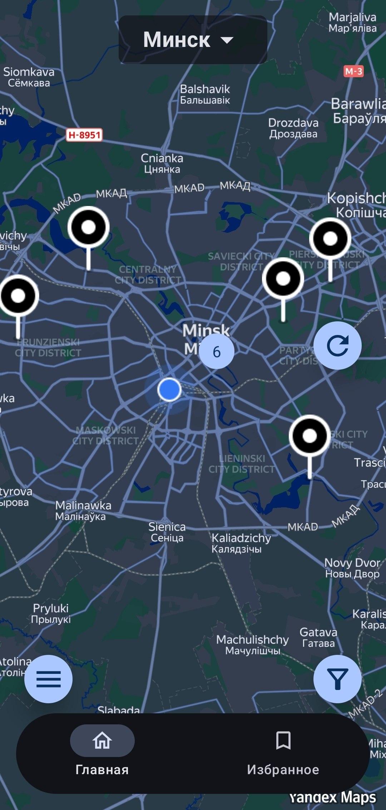
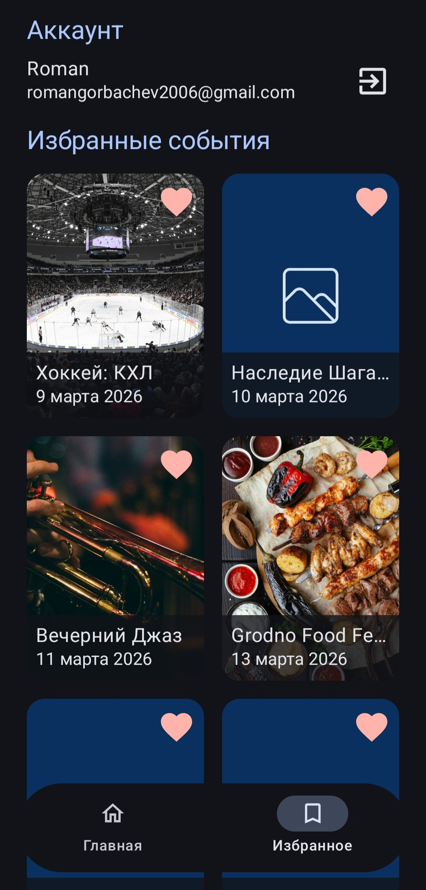
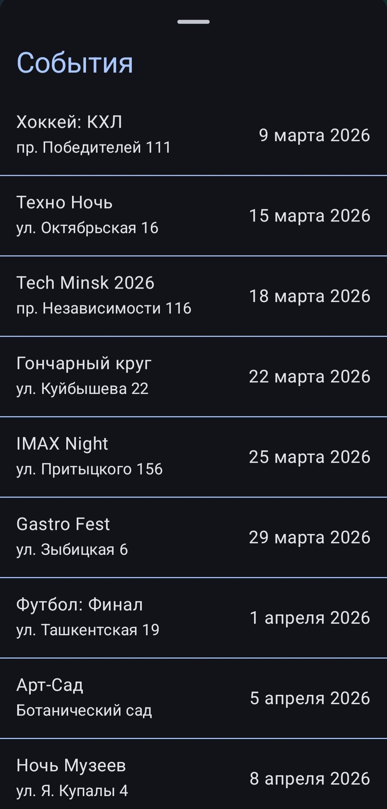
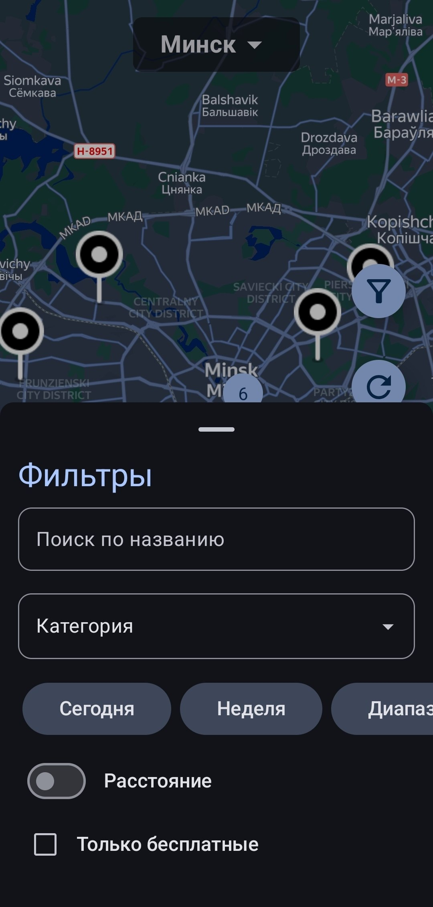
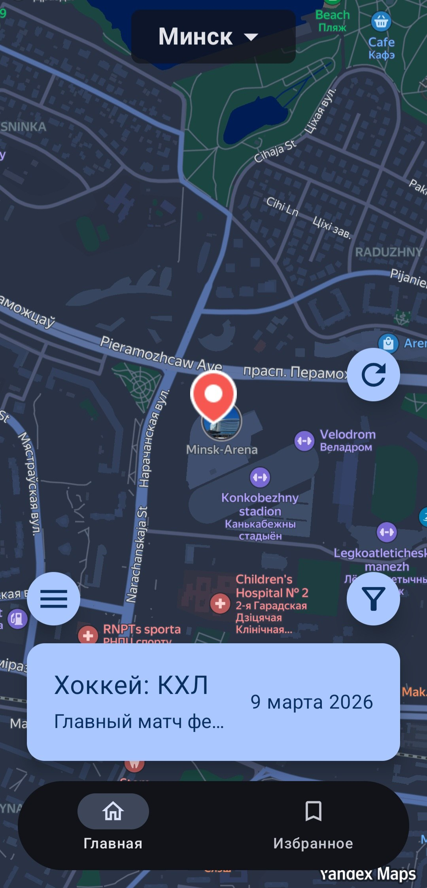

# LocalEventsMapApp

**LocalEventsMap** is a mobile application for finding interesting events in your city.

## About project
The app solves the problem of finding leisure activities by displaying current events on an interactive map.
With the help of **offline-first approach** you can view previously downloaded events and the map without Internet access.

***

## Screenshots
|                     Map                      |                  Details Event                   |                     Bookmarks                      |
|:--------------------------------------------:|:------------------------------------------------:|:--------------------------------------------------:|
|  |  |  |  |

|                List of events                 |                     Filters                      |                     Selected event                      |
|:---------------------------------------------:|:------------------------------------------------:|:-------------------------------------------------------:|
|  |  |  |  |


## Tech Stack
- **Language**: Kotlin
- **UI**: Jetpack Compose (Material3)
- **Architecture**: MVVM + Clean Architecture
- **Map**: Yandex MapKit
- **Local Storage**: Room Database
- **Remote Storage**: Firebase Realtime Database
- **Auth**: Firebase Auth
- **Notification**: Firebase Messaging Service
- **Asynchrony**: Kotlin Coroutines
- **DI**: Hilt
- **Images**: Coil

## Features
- Displaying events with clustering
- Data caching with Room. When there is no internet connection, the application displays the last downloaded data.
- Sign In and Sign Up with Firebase
- The ability to save events to the bookmarks

## Setup
- Clone the repository
- You need to get API key of Yandex MapKit in the [Yandex Developer Dashboard](https://developer.tech.yandex.ru/)
- Put it in local.properties file
```
YANDEX_KEY=your_api_key
```
- Sync gradle and setup the project
